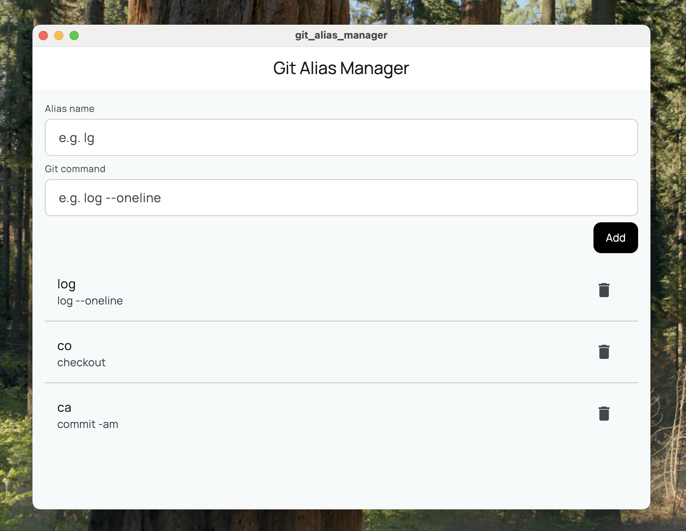

# Git Alias Manager

A cross-platform desktop Flutter app to view, add, and manage your global Git command aliases.

## About the project

This is a minimal project built to solve a specific problem quickly and effectively. The architecture has been intentionally kept simple to focus on delivering value fast. For now, there's no dedicated state management solution in place, but that can evolve as the project grows.

## Features

- List all global Git aliases
- Add new aliases (name + command)
- Delete existing aliases
- Material and dark theme support
- Works on macOS, Windows, and Linux (tested only on macOS for now)

## Requirements

- Git must be installed and available in your system PATH

## Project Structure

- `lib/`
  - `main.dart` — App entry point
  - `sources/` — Git alias data sources
  - `view/` — UI screens and widgets
  - `shell/` — System command runner

## Contributing

Pull requests are welcome! For major changes, please open an issue first to discuss what you would like to change.

## License

[MIT](LICENSE)
